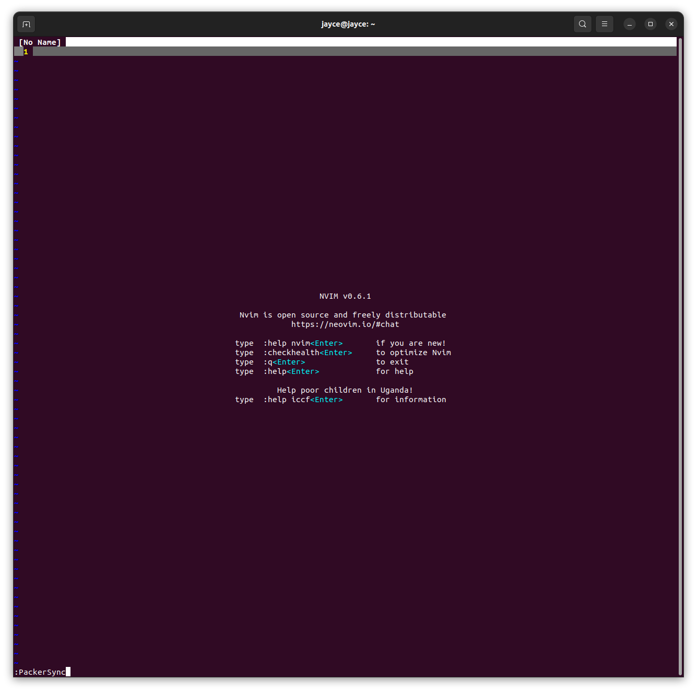

**安装最新**

```bash
$ wget https://github.com/neovim/neovim/releases/download/v0.7.2/nvim-linux64.deb
$ sudo apt install ./nvim-linux64.deb
```

```bash
$ nvim --version
v0.8.0
....
....
```


**克隆配置**

```bash
$ git clone https://github.com/itsuki0927/SkCode ~/.config/nvim
$ nvim +PackerSync
```

> https://itsuki.cn/article/168




