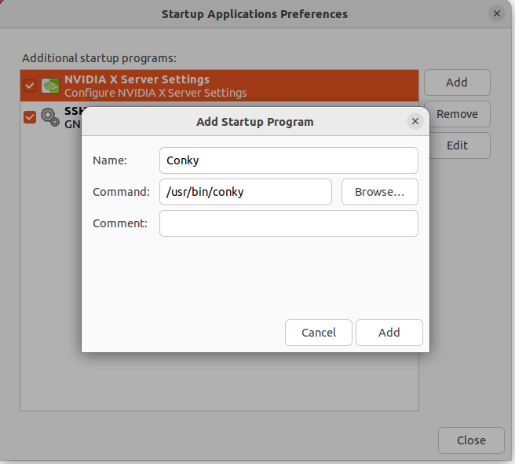

安装状态栏监控widget

```
sudo apt install indicator-multiload
```


command-line 监控 htop

```bash
$ sudo apt install htop
$ htop
```

conky 安装

https://askubuntu.com/a/1014284

https://linuxconfig.org/ubuntu-22-04-system-monitoring-with-conky-widgets

1. 安装

   ```bash
   $ sudo apt install conky-all
   ```

2. 添加开机启动项

   Startup Application

   

3. 配置conky

   ```bash
   $ cp /etc/conky/conky.conf ~/.conkyrc
   $ gedit ~/.conkyrc
   ```

   

4. 

